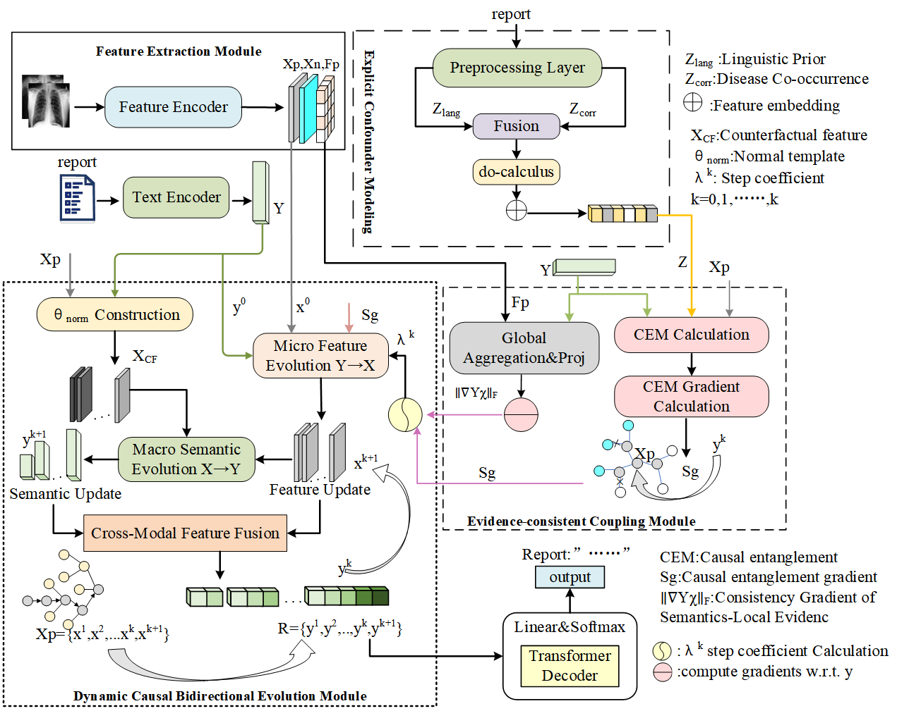

# C3E-RRG

This is the implementation of [C3E-RRG:Confounder-Aware Causal Evidence Coupling and Evolution for Chest X-Ray Report Generation](...).
This codebase includes confounder proxy representation learning, an evidence-consistent coupling module (i.e., the causal entanglement module), and a dynamic bidirectional causal evolution module. 
It provides the implementation of the C3E-RRG model (DYMES) and supports training and fine-tuning on the MIMIC-CXR and IU X-Ray datasets.
The CheXpert labeler code is available at https://github.com/stanfordmlgroup/chexpert-labeler.
# C3E-RRG: Confounder-Aware Causal Evidence Coupling and Evolution for Chest X-Ray Report Generation

## Project Structure
The code structure of our C3E-RRG is organized as follows:

```text
C3E-RRG/
├── config/ # Configuration files for datasets
│   ├── iu_xray/
│   │   ├── baseline.json
│   │   └── iu_dymes.json
│   └── mimic_cxr/
│       └── baseline.json
│       └── mimic_dymes.json
├── models/ # Model architectures
│   ├── __init__.py
│   ├── baseline.py
│   └── dymes.py # Our proposed C3E-RRG model
│
├── modules/ # Core network modules
│   ├── __init__.py
│   ├── beam_search.py
│   ├── coatnet.py
│   ├── misc.py
│   ├── modules4transformer.py
│   ├── feature_disentanglement/ # Visual feature extraction (CMCRL)
│   ├── modules4vlp.py
│   ├── pos_embed.py
│   ├── bidirectional_evolution.py
│   ├── causal_entanglement.py
│   ├── causal_hollow_index.py
│   └── confounder_modeling.py
│
├── data/ # Dataset processing
│   ├── datadownloader.py
│   ├── iu_xray/
│   └── mimic-cxr/
│
├── metric/ # Evaluation metrics
│   ├── bleu/
│   ├── cider/
│   ├── meteor/
│   ├── rouge/
│   ├── metrics.py
│   ├── __init__.py
│   └── eval.py
│
├── trainer/ # Training pipelines
│   ├── __init__.py
│   ├── BaseTrainer.py
│   ├── PretrainTrainer.py
│   └── FinetuneTrainer.py
│
├── utils/ # Utility functions
│   ├── __init__.py
│   ├── cvt_im_tensor.py
│   ├── dataloaders.py
│   ├── dataset.py
│   ├── html_utils.py
│   ├── loss.py
│   ├── optimizers.py
│   ├── tensor_utils.py
│   ├── monitor.py
│   ├── tokenizers_utils.py
│   └── vis_utils.py # Visualization tools
│
├── tools/ # Preprocessing tools
│   ├── normal_template/ # Normal template construction
│   ├── build_disease_corr.py # Disease co-occurrence matrix
│   └── build_pmi_matrix.py # Language prior matrix
│
├── pretrain/ # Pre-trained files & matrices
│   ├── iu_xray/
│   │   ├── disease_corr_iu_xray.npy
│   │   ├── pmi_matrix_iu_xray.pt
│   │   └── normal_template_iu_xray.npy
│   ├── mimic_cxr/
│   │   ├── disease_corr_mimic_cxr.npy
│   │   ├── pmi_matrix_mimic_cxr.pt
│   │   └── normal_template_mimic_cxr.npy
│
├── results/ # Experimental results
│   ├── iu_xray/
│   └── mimic_cxr/
│
├── main.py # Main entry
├── requirements.yaml # Environment dependencies
├── README.md
└── .gitignore
<div align=center>
```


</div>

## Requirements
All the requirements are listed in the requirements.yaml file. Please use this command to create a new environment and activate it.

```
conda env create -f requirements.yaml
conda activate mrg
```

## Preparation
1. Datasets: 
You can download the dataset via `data/datadownloader.py`, or download from the repo of [R2Gen](https://github.com/cuhksz-nlp/R2Gen).
Then, unzip the files into `data/iu_xray` and `data/mimic_cxr`, respectively. 
2. Models: We provide the well-trained models and metrics of C3E-RRG for inference, and you can download from [here](My C3E-RRG
 https://pan.baidu.com/s/19MLWLorCIGLi6uSOf8lZWQ?pwd=6688).
3. Please remember to change the path of data and models in the config file (`config/*.json`).

## Evaluation
- For C3E-RRG on IU-Xray dataset 

```
python main.py -c config/iu_xray/iu_dymes.json
```

<div align=center>

| Method | Year | B@1 | B@2 | B@3 | B@4 | M | R |
|:------:|:----:|:---:|:---:|:---:|:---:|:---:|:---:|
| R2Gen [6] | 2020 | 0.470 | 0.309 | 0.219 | 0.165 | 0.187 | 0.371 |
| Clinical-BERT [53] | 2022 | 0.495 | 0.330 | 0.231 | 0.170 | - | 0.376 |
| METransformer [55] | 2023 | 0.483 | 0.322 | 0.228 | 0.172 | 0.192 | 0.380 |
| M2KG [54] | 2023 | 0.497 | 0.319 | 0.230 | 0.174 | - | 0.399 |
| RAMT [59] | 2024 | 0.480 | 0.302 | 0.214 | 0.159 | 0.196 | 0.368 |
| MA [57] | 2024 | 0.501 | 0.328 | 0.230 | 0.170 | 0.213 | 0.387 |
| S3-Net [58] | 2024 | 0.499 | 0.334 | 0.246 | 0.172 | 0.206 | 0.401 |
| FMVP [56] | 2024 | 0.485 | 0.315 | 0.225 | 0.169 | 0.201 | 0.398 |
| CMCRL [24] | 2025 | 0.505 | 0.334 | 0.245 | 0.190 | 0.210 | 0.394 |
| STREAM [11] | 2025 | 0.506 | 0.338 | 0.248 | 0.188 | 0.215 | 0.387 |
| MMG [60] | 2025 | 0.497 | 0.333 | 0.240 | 0.185 | 0.215 | 0.399 |
| KERM [62] | 2026 | 0.511 | 0.333 | 0.249 | 0.182 | 0.197 | 0.388 |
| C2M-DoT [63] | 2026 | 0.458 | 0.321 | 0.230 | 0.159 | 0.203 | 0.380 |
| **C3E-RRG (Ours)** | 2026 | **0.513** | **0.348** | **0.256** | **0.195** | **0.211** | **0.407** |
| ± Std | - | 0.0015 | 0.0019 | 0.0017 | 0.0013 | 0.0079 | 0.0019 |

</div>

- For C3E-RRG on MIMIC-CXR dataset

```
python main.py -c config/mimic_cxr/mimic_dymes.json
```
<div align=center>

| Method | Year | B@1 | B@2 | B@3 | B@4 | M | R | P | Rec | F1 |
|:------:|:----:|:---:|:---:|:---:|:---:|:---:|:---:|:---:|:---:|:---:|
| R2Gen [6] | 2020 | 0.353 | 0.218 | 0.145 | 0.103 | 0.142 | 0.277 | 0.333 | 0.273 | 0.276 |
| Clinical-BERT [53] | 2022 | 0.383 | 0.230 | 0.151 | 0.106 | 0.144 | 0.275 | 0.397 | 0.435 | 0.415 |
| KiUT [28] | 2023 | 0.393 | 0.243 | 0.159 | 0.113 | 0.160 | 0.285 | 0.371 | 0.318 | 0.321 |
| M2KG [54] | 2023 | 0.386 | 0.237 | 0.157 | 0.111 | - | 0.274 | 0.420 | 0.339 | 0.352 |
| RAMT [59] | 2024 | 0.358 | 0.221 | 0.148 | 0.106 | 0.153 | 0.289 | 0.362 | 0.304 | 0.309 |
| MA [57] | 2024 | 0.396 | 0.244 | 0.162 | 0.115 | 0.151 | 0.274 | 0.411 | 0.398 | 0.389 |
| S3-Net [58] | 2024 | 0.358 | 0.239 | 0.158 | 0.125 | 0.152 | 0.291 | - | - | - |
| FMVP [56] | 2024 | 0.389 | 0.236 | 0.156 | 0.108 | 0.150 | 0.284 | 0.332 | 0.383 | 0.336 |
| CMCRL [24] | 2025 | 0.400 | 0.245 | 0.165 | 0.119 | 0.150 | 0.280 | 0.489 | 0.340 | 0.401 |
| MMG [60] | 2025 | 0.381 | 0.241 | 0.161 | 0.119 | 0.161 | 0.285 | - | - | - |
| CGFN+GRN [61] | 2025 | 0.380 | 0.233 | 0.155 | 0.111 | 0.140 | 0.273 | - | - | - |
| KERM [62] | 2026 | 0.378 | 0.235 | 0.157 | 0.109 | 0.152 | 0.283 | 0.394 | 0.436 | 0.425 |
| ChestXGen [64] | 2026 | 0.371 | 0.243 | 0.163 | 0.129 | 0.152 | 0.283 | - | - | - |
| **C3E-RRG (Ours)** | 2026 | **0.411** | **0.251** | **0.165** | **0.115** | 0.151 | 0.280 | **0.520** | 0.350 | **0.420** |
| ± Std | - | 0.0013 | 0.0016 | 0.0005 | 0.0012 | 0.0023 | 0.0025 | - | - | - |

</div>

## Citation
If you use this code for your research, please cite our paper.

## Contact
First Author: Sha Yang, Kunming University of Science and Technology Kunming, Yunnan CHINA, email: 746498201@qq.com

Corresponding Author: Lijun Liu, Ph.D., Kunming University of Science and Technology Kunming, Yunnan CHINA, email: cloneiq@kust.edu.cn
## Acknowledges
We thank [R2Gen](https://github.com/cuhksz-nlp/R2Gen) and [CMCRL](https://github.com/WissingChen/CMCRL )for their open source works.
